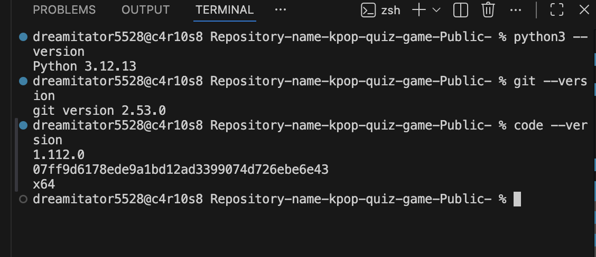
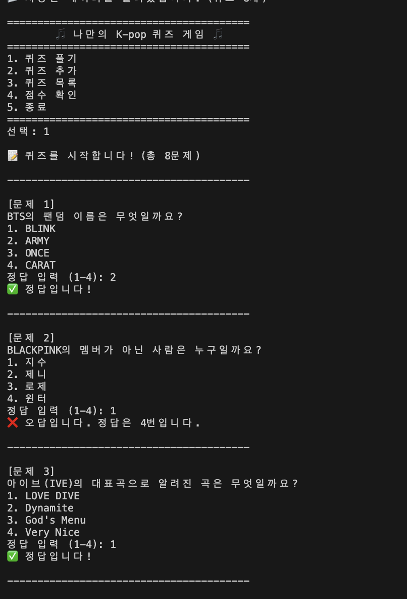
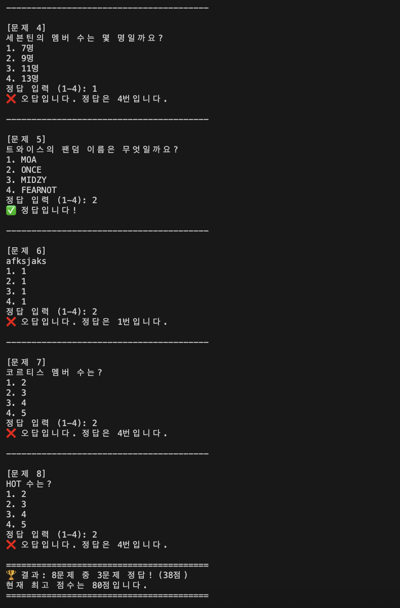
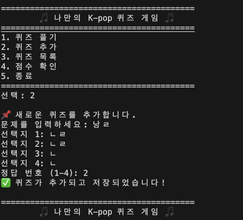
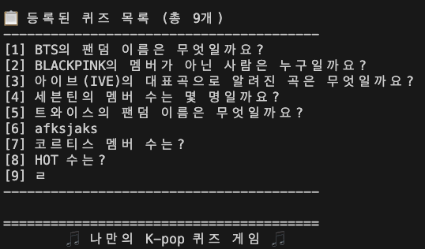
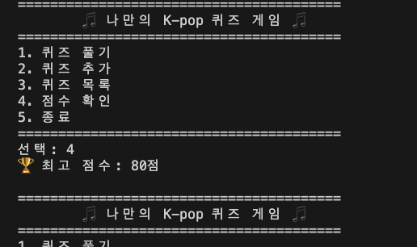
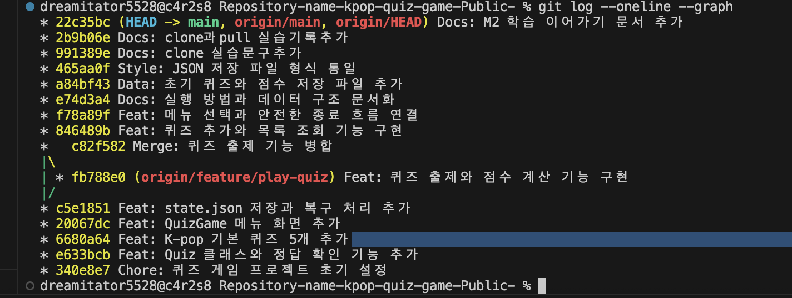
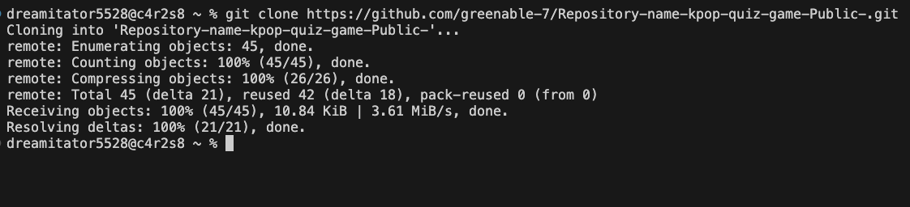
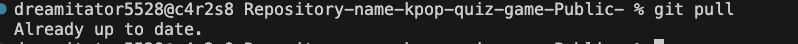

# 🎵 K-pop 퀴즈 게임

터미널에서 실행하는 **Python 기반 K-pop 퀴즈 게임**입니다.  
사용자는 저장된 퀴즈를 풀고, 새로운 퀴즈를 추가하고, 퀴즈 목록과 최고 점수를 확인할 수 있습니다.

프로그램을 종료한 뒤 다시 실행해도 **추가한 퀴즈와 최고 점수가 `state.json`에 저장되어 유지**됩니다.

---

## 1. 프로젝트 개요

이 프로젝트는 Python 기본 문법과 객체 지향 프로그래밍, JSON 파일 입출력, 예외 처리, Git 브랜치 작업을 연습하기 위해 만든 콘솔 퀴즈 게임입니다.

프로그램을 실행하면 다음 메뉴를 사용할 수 있습니다.

1. 퀴즈 풀기
2. 퀴즈 추가
3. 퀴즈 목록
4. 점수 확인
5. 종료

사용자가 메뉴 번호를 선택하면 각 기능이 실행되며, 잘못된 입력이 들어오면 안내 메시지를 출력한 뒤 다시 입력할 수 있도록 처리했습니다.

---

## 2. 퀴즈 주제와 선정 이유

퀴즈 주제는 **K-pop**입니다.

K-pop은 BTS, BLACKPINK, IVE, SEVENTEEN, TWICE 등 익숙한 아티스트를 바탕으로 문제를 만들 수 있어 흥미를 유도하기 좋고, 사용자도 부담 없이 참여할 수 있는 주제라고 생각해 선정했습니다.

기본 퀴즈는 직접 작성한 **K-pop 문제 5개 이상**으로 구성되어 있습니다.

---

## 3. 개발 환경

이 프로젝트는 다음 환경에서 개발하고 실행했습니다.

- Python 3.12.13
- Git 2.53.0
- Visual Studio Code 1.112.0
- Python 외부 라이브러리 사용 없음
- Python 표준 라이브러리 사용
  - `json`
  - `pathlib`

개발 환경의 버전은 터미널에서 다음 명령어로 확인했습니다.

```bash
python3 --version
git --version
code --version
```

### 개발 환경 확인 화면

아래 화면에서 Python, Git, Visual Studio Code의 설치 및 버전을 확인할 수 있습니다.



---

## 4. 실행 방법

### 1) GitHub 저장소 복제

```bash
git clone https://github.com/greenable-7/Repository-name-kpop-quiz-game-Public-.git
```

### 2) 프로젝트 폴더로 이동

```bash
cd Repository-name-kpop-quiz-game-Public-
```

### 3) 프로그램 실행

```bash
python3 main.py
```

---

## 5. 주요 기능

### 5-1. 퀴즈 풀기

- 저장된 퀴즈를 순서대로 출제합니다.
- 사용자는 정답 번호 `1~4` 중 하나를 입력합니다.
- 입력한 답이 맞는지 바로 확인할 수 있습니다.
- 모든 문제를 풀면 정답 개수와 점수를 출력합니다.
- 기존 최고 점수보다 높은 경우 최고 점수를 갱신합니다.
- 갱신된 최고 점수는 `state.json`에 저장됩니다.
- 등록된 퀴즈가 없으면 안내 메시지를 출력합니다.





---

### 5-2. 퀴즈 추가

- 새로운 문제를 직접 입력할 수 있습니다.
- 선택지 4개를 입력합니다.
- 정답 번호를 `1~4` 범위에서 입력합니다.
- 빈 문제나 빈 선택지가 입력되지 않도록 처리합니다.
- 잘못된 정답 번호를 입력하면 다시 입력하도록 안내합니다.
- 추가한 퀴즈는 바로 `state.json`에 저장됩니다.



---

### 5-3. 퀴즈 목록

- 현재 저장되어 있는 퀴즈를 번호와 함께 확인할 수 있습니다.
- 퀴즈가 하나도 없으면 별도의 안내 메시지를 출력합니다.



---

### 5-4. 점수 확인

- 지금까지 기록된 최고 점수를 확인할 수 있습니다.
- 아직 퀴즈를 한 번도 풀지 않은 경우 기록이 없다는 안내 메시지를 출력합니다.



---

### 5-5. 입력 및 예외 처리

숫자 입력이 필요한 곳에서는 다음 상황을 처리합니다.

- 입력 앞뒤 공백
- 빈 입력
- 숫자가 아닌 문자 입력
- 허용 범위를 벗어난 숫자 입력
- `Ctrl+C` (`KeyboardInterrupt`)
- 입력 스트림 종료 (`EOFError`)

또한 데이터 파일과 관련하여 다음 상황을 처리합니다.

- `state.json` 파일이 없는 경우
- `state.json` 파일을 읽는 과정에서 오류가 발생한 경우
- 저장된 데이터가 손상된 경우

문제가 발생하면 가능한 범위에서 기본 퀴즈 데이터를 사용하여 프로그램이 다시 실행될 수 있도록 구성했습니다.

---

## 6. Quiz 클래스와 QuizGame 클래스 차이

| 구분 | `Quiz` 클래스 | `QuizGame` 클래스 |
|---|---|---|
| 역할 | 퀴즈 **한 문제**를 표현 | 퀴즈 게임 **전체를 관리** |
| 관리하는 데이터 | 문제, 선택지 4개, 정답 번호 | 퀴즈 목록, 최고 점수, 저장 파일 |
| 담당 범위 | 한 문제의 정보와 정답 확인 | 메뉴, 퀴즈 진행, 추가, 목록, 점수, 저장/불러오기 |
| 객체의 의미 | 실제 퀴즈 한 문제 | 여러 퀴즈를 가지고 게임을 운영하는 관리자 |
| 관계 | 여러 개의 `Quiz` 객체가 게임 안에서 사용됨 | 여러 `Quiz` 객체를 모아 전체 게임을 실행함 |
| 간단한 비유 | 시험지의 **문제 한 개** | 시험 전체를 운영하는 **시험 감독관** |

`Quiz`는 **한 문제 자체를 표현하기 위한 클래스**이고,  
`QuizGame`은 여러 `Quiz` 객체를 가지고 **게임 전체의 흐름을 관리하기 위한 클래스**입니다.

---

## 7. 파일 및 디렉토리 구조

```text
Repository-name-kpop-quiz-game-Public-/
├── main.py
│   # 프로그램의 시작점
│   # 메뉴를 반복해서 보여주고 사용자의 선택에 따라 기능을 실행
│
├── game.py
│   # QuizGame 클래스 정의
│   # 퀴즈 풀기, 추가, 목록, 점수 확인, 저장/불러오기 등 게임 전체 흐름 담당
│
├── quiz.py
│   # Quiz 클래스 정의
│   # 퀴즈 한 문제의 문제, 선택지, 정답 정보를 관리
│
├── default_data.py
│   # 프로그램을 처음 실행할 때 사용할 기본 K-pop 퀴즈 데이터
│
├── state.json
│   # 사용자가 추가한 퀴즈와 최고 점수를 저장
│   # 프로그램을 종료한 뒤 다시 실행해도 데이터를 유지하기 위해 사용
│
├── README.md
│   # 프로젝트 개요, 실행 방법, 기능, 파일 구조 등을 설명하는 문서
│
├── STUDY_CONTEXT.md
│   # 프로젝트를 진행하며 학습한 내용을 정리한 개인 학습 문서
│
├── .gitignore
│   # Git에서 추적하지 않을 파일이나 폴더를 설정
│
└── screenshots/
    # 프로그램 실행 결과와 Git 실습 내용을 증빙하기 위한 이미지 폴더

    ├── 개발환경.png
    │   # Python, Git, Visual Studio Code 버전 확인 화면
    │
    ├── 퀴즈풀기1.png
    │   # 퀴즈 풀기 실행 화면 1
    │
    ├── 퀴즈풀기2.png
    │   # 퀴즈 풀기 실행 화면 2
    │
    ├── 퀴즈추가.png
    │   # 새로운 퀴즈를 추가하는 실행 화면
    │
    ├── 퀴즈목록.png
    │   # 저장된 퀴즈 목록 확인 화면
    │
    ├── 점수확인.png
    │   # 최고 점수 확인 화면
    │
    ├── 깃로그.png
    │   # git log --oneline --graph 실행 결과
    │
    ├── 깃클론.png
    │   # git clone 실습 화면
    │
    └── 깃풀.png
        # git pull 실습 화면
```

---

## 8. 데이터 파일 설명 (`state.json`)

프로그램에서 사용하는 데이터는 프로젝트 루트의 `state.json` 파일에 UTF-8 형식으로 저장됩니다.

`state.json`에는 크게 다음 두 가지 정보가 저장됩니다.

- 등록된 퀴즈 목록
- 최고 점수

저장 구조 예시는 다음과 같습니다.

```json
{
  "quizzes": [
    {
      "question": "문제 내용",
      "choices": [
        "선택지 1",
        "선택지 2",
        "선택지 3",
        "선택지 4"
      ],
      "answer": 1
    }
  ],
  "best_score": 80
}
```

각 데이터의 의미는 다음과 같습니다.

- `quizzes` : 저장된 전체 퀴즈 목록
- `question` : 퀴즈 문제
- `choices` : 선택지 4개
- `answer` : 정답 번호 (`1~4`)
- `best_score` : 지금까지 기록된 최고 점수

프로그램을 처음 실행해 `state.json`이 존재하지 않으면 `default_data.py`의 기본 K-pop 퀴즈를 사용합니다.

파일을 읽는 과정에서 오류가 발생하면 안내 메시지를 출력하고 기본 데이터로 복구할 수 있도록 예외 처리를 적용했습니다.

---

## 9. Git 작업 기록

이 프로젝트는 Git을 이용해 기능 단위로 변경 사항을 기록했습니다.

### 주요 Git 작업

- Git 저장소 설정
- 기능 단위 commit
- GitHub 원격 저장소 push
- 별도의 기능 브랜치 생성
- 기능 브랜치에서 퀴즈 출제 기능 작업
- `main` 브랜치로 merge
- GitHub 저장소 clone
- 복제한 저장소에서 변경 후 push
- 기존 작업 폴더에서 pull

### Git 로그 및 브랜치 병합 확인

기능별 커밋과 브랜치 병합 기록은 `git log --oneline --graph`를 통해 확인했습니다.



---

### Git clone 실습

개발이 완료된 저장소를 별도의 로컬 디렉토리에 복제하기 위해 `git clone`을 사용했습니다.

```bash
git clone https://github.com/greenable-7/Repository-name-kpop-quiz-game-Public-.git
```



---

### Git pull 실습

복제된 저장소에서 변경한 내용을 GitHub에 push한 뒤, 기존 작업 디렉토리에서 `git pull`을 실행하여 변경 사항을 가져오는 실습을 진행했습니다.



---

## 10. 프로젝트를 통해 학습한 내용

이 프로젝트를 통해 다음 내용을 직접 구현하고 연습했습니다.

- 변수와 Python 기본 자료형
- `if / elif / else` 조건문
- `for`, `while` 반복문
- 함수 정의와 호출
- 클래스와 객체
- `__init__`과 `self`
- 리스트와 딕셔너리
- JSON 파일 읽기와 쓰기
- `try / except` 예외 처리
- 프로그램 데이터 영속성
- Git commit
- Git branch
- Git merge
- Git push
- Git pull
- Git clone

---

## 11. 프로젝트 정리

이 프로젝트는 단순히 문제를 출력하는 프로그램이 아니라 사용자가 직접 상호작용할 수 있는 작은 콘솔 프로그램입니다.

사용자는 프로그램에서

- 퀴즈를 풀고
- 새로운 퀴즈를 추가하고
- 저장된 퀴즈 목록을 확인하고
- 최고 점수를 확인할 수 있습니다.

또한 데이터를 `state.json`에 저장하기 때문에 프로그램을 종료한 후 다시 실행해도 이전의 퀴즈와 점수가 유지됩니다.

이를 통해 Python의 기본 문법뿐 아니라 **클래스와 객체, 파일 입출력, 예외 처리, Git을 이용한 버전 관리와 브랜치 작업 흐름**까지 함께 연습했습니다.
